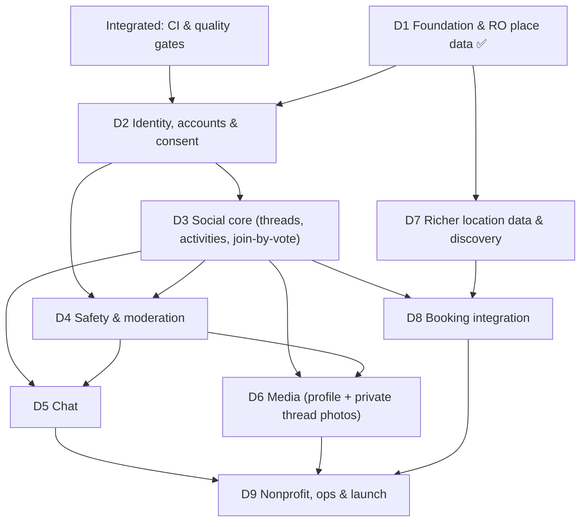

# Roadmap

The master orchestration document. It captures **every** feature from the original product
vision, slots each into a deliverable, sequences them by dependency, and calls out the
**integrated steps** (infrastructure / sequencing / legal gates) that aren't a single feature
but are required to glue the product together safely.

See also: [ARCHITECTURE](ARCHITECTURE.md) · [COMPLIANCE](COMPLIANCE.md) ·
[SAFETY](SAFETY.md) · [SECURITY](SECURITY.md) · [DATA_AND_INTEGRATIONS](DATA_AND_INTEGRATIONS.md) ·
[MULTI_AGENT_BUILD](MULTI_AGENT_BUILD.md) (how to build this in parallel)

## Vision & principles

A nonprofit, open-source platform to help people — **children first**, also adults — meet in
person to do real activities (sports, reading, board/video games). It is deliberately the
**opposite** of image-perfect / short-video social media:

- **Text-first.** No public photo feeds. Photos exist only privately inside an activity thread.
- **Safe by design**, especially for minors: EU-grade identity/age assurance, age-cohort
  isolation, strong moderation, no adult↔minor private contact.
- **Real places.** The app already knows where activities can happen (seeded from open data),
  so users rarely have to create places.
- **Cheap, scalable, open source.** PostgreSQL as the primary datastore; lean EU hosting.
- **Nonprofit.** Funded by donations. No ads, no behavioural tracking, no engagement-maxxing.

## How to read this

Status legend: ✅ Done · ▶️ Next · ⏳ Planned · 🧊 Backlog

Each deliverable lists **Goal · Scope · Depends on · Integrated steps · Definition of done**.
Deliverables are intentionally shippable in order; later ones plug into seams left by earlier
ones (see [ARCHITECTURE](ARCHITECTURE.md)).

## Dependency overview

## Cross-cutting integrated steps (not features — but required)

These thread through multiple deliverables. Skipping them creates rework or legal risk.

- **IS-1 · Custom user model first.** Introduce `accounts.User` (custom `AUTH_USER_MODEL`) at the
  very start of D2, *before* any app references users. Changing the user model after tables
  reference it is extremely painful in Django. D1 deliberately left only `# FUTURE:` user FKs.
- **IS-2 · CI & quality gates.** GitHub Actions running `ruff`, `pytest`, `makemigrations
  --check`, **`pip-audit`**, and a Docker build; pre-commit; dependency updates
  (Dependabot/Renovate, review-then-merge); secret scanning. Land before multi-developer /
  multiplayer features (start of D2). Dependency policy: [SECURITY](SECURITY.md).
- **IS-3 · EU data residency from day one.** First real deploy must be EU-hosted (e.g. Hetzner
  EU, or an EU region of a managed provider). Non-negotiable for GDPR + children's data.
- **IS-4 · Legal gates before processing children's data.** A **DPIA** (GDPR Art. 35),
  Privacy Policy, Terms, and a parental-consent record-keeping design must exist *before* D2
  goes live to real minors. See [COMPLIANCE](COMPLIANCE.md).
- **IS-5 · Moderation tooling alongside social, not after.** Reporting, blocking, and a
  review queue ship *with* D3/D4 — never bolted on later.
- **IS-6 · Privacy-respecting observability.** Error tracking + aggregate metrics with **no
  per-user behavioural analytics**. Self-hosted/aggregate only (consistent with the nonprofit,
  no-tracking principle).
- **IS-7 · Localization & accessibility.** RO + EN from D3; WCAG-minded UI; this is also a
  child-usability concern.

---

## D1 · Foundation & Romania place data ✅ (shipped)

- **Goal.** Stand up the project and the activity↔place **knowledge graph**; collect Romanian
  places from open data so users don't have to create them.
- **Scope (done).** Django 5.1 + DRF + PostGIS skeleton; `taxonomy` (categories, activity types
  is-a tree, typed relations); `places` (`Place` + `PlaceActivity` edge with provenance);
  `ingestion` (Overpass adapter + OSM→activity mapping + idempotent `ingest_places` command,
  scoped to one city); read-only GeoJSON + taxonomy APIs; admin map; Docker; tests.
- **Definition of done.** ✅ All met — see repo `README.md`.

## D2 · Identity, accounts & consent ▶️ (in progress)

> **Scaffold landed** (branch `claude/d2-identity-accounts`): custom `accounts.User` (IS-1),
> `AgeBand`/`Cohort`, `ParentalConsent` + `AgeAssurance` models, the pluggable `IdentityProvider`
> interface with a **dev stub** + an **EUDI stub**, cohort assignment + a `can_participate` consent
> gate, `/api/accounts/me/`, admin, and tests. **Pending:** the real EUDI Wallet / EU
> age-verification integration and the parental-consent UX/record-keeping.

- **Goal.** Let real people (incl. minors) onboard with **EU-grade identity/age assurance** and
  **verifiable parental consent**, without the app hoarding identity data.
- **Scope.**
  - **IS-1** custom `accounts.User`; profile (display name + single profile picture — see D6).
  - Pluggable `IdentityProvider` interface (so we're not locked to one scheme).
  - Integrate the **EUDI Wallet** + EU **age-verification** flow → store an **age band**
    (e.g. <16 / 16–17 / adult), not exact DOB where avoidable. *(EU age-verification app
    feature-ready Apr 2026; Romania's national EUDI wallet due Dec 2026.)*
  - **Unique child identifier issued with parental permission**: parental-consent flow for
    under-16, verifiable, with consent records and a revocation/expiry path.
  - **Cohort assignment** from age band (used by D3/D4 to keep children with similar-age peers).
- **Depends on.** D1, IS-1, IS-2, IS-3, IS-4.
- **Integrated steps.** DPIA + Privacy Policy + Terms live before real-minor onboarding (IS-4).
- **Definition of done.** A user can register and prove an age band via the EU flow; an under-16
  cannot use the service without a validated parental consent record; age band + cohort are
  available to other apps via a stable interface. See [COMPLIANCE](COMPLIANCE.md).

## D3 · Social core — threads, activities, join-by-vote ⏳

- **Goal.** The actual product loop: organize an activity at a place, with a thread, and a
  democratic way to let new people in.
- **Scope.**
  - `Activity` (a meetup) = `Place` (D1) + `ActivityType` (D1) + time/window + owner.
  - `Thread` + text `Post`s (text-first; photos deferred to D6).
  - `Membership` with roles (owner, member) and states (requested, member, removed).
  - **Join-by-vote**: a join request is approved when a **configurable threshold (default
    two-thirds, "66%") of current participants** approve. Owner override configurable.
  - **User-submitted places requiring a multi-user quorum** to become public (co-creation:
    N independent confirmations before a `source=user` place is published). Plugs into the D1
    `Place.source`/`PlaceActivity.origin` seams (`# FUTURE: created_by`).
  - **Age-cohort enforcement**: children's activities are visible/joinable only within a
    similar-age cohort (enforced using D2 cohort data).
- **Depends on.** D2 (users, cohorts), D1 (places/activities).
- **Integrated steps.** IS-5 (moderation primitives land here), IS-7 (RO/EN).
- **Definition of done.** A cohort-appropriate user can create an activity at a real place, post
  in its thread, and a new member can be admitted only via the voting threshold; a user-proposed
  place needs the quorum before going public.

## D4 · Safety & moderation ⏳ (parallels D3)

- **Goal.** Make it a genuinely safe place for children — the core promise.
- **Scope.**
  - **Anti-grooming**: no private adult↔minor contact; cohort isolation enforced across
    discovery, threads, and chat; conservative defaults.
  - Reporting & blocking; a moderation **review queue** (built on Django admin); audit logging.
  - Rate limits / anti-abuse; content policy; account-takeover protections.
  - Trust-&-safety escalation path; minor-specific safeguards (DSA Art. 28 alignment).
- **Depends on.** D2, D3.
- **Definition of done.** Users can report/block; moderators can action reports from a queue;
  cohort isolation is verifiably enforced; safety events are audit-logged. See [SAFETY](SAFETY.md).

## D5 · Chat ⏳

- **Goal.** Real-time conversation **inside an activity thread**, private to its members.
- **Scope.** ASGI/Channels consumers over the `config/asgi.py` seam; per-thread rooms scoped to
  membership + cohort; moderation hooks (D4); message retention policy. **Encryption/scanning
  posture kept swappable** pending the EU CSAR outcome (see [COMPLIANCE](COMPLIANCE.md)).
- **Depends on.** D3 (threads/membership), D4 (moderation).
- **Definition of done.** Members of an activity can chat in real time; non-members/other cohorts
  cannot; messages are moderatable; the scanning/encryption strategy is a documented, swappable
  policy.

## D6 · Media — profile + private thread photos ⏳

- **Goal.** The *only* images in the product: one profile picture, and photos shared **privately
  inside an activity thread** (visible only to that thread's members). No public photo feed.
- **Scope.** S3-compatible **object storage** (Cloudflare R2 or self-hosted MinIO) — Postgres
  keeps relational/graph/geo data, blobs go to cheap object storage; upload limits; **image
  safety scanning** (e.g. CSAM hash-matching where lawful) before a photo is visible; EXIF/GPS
  stripping; signed, expiring URLs scoped to thread membership.
- **Depends on.** D3 (threads), D4 (safety scanning).
- **Definition of done.** A user can set a profile picture and post photos in a thread that only
  members can see; uploads are size-limited, metadata-stripped, and safety-screened.

## D7 · Richer location data & discovery ⏳

- **Goal.** Better coverage + "what's around me / is it open / is something happening there",
  reducing the need for users to create places.
- **Scope.**
  - Implement the **Overture** adapter (the D1 stub) for bulk open coverage.
  - **Optional paid Google Places enrichment**: open-now/live status, popular times, links.
  - **Events**: associate happenings with places where data allows.
  - Cross-source **dedup/merge**; `opening_hours` parsing (D1 stores raw).
  - **Area suggestions / recommendations** (interest similarity via `pgvector`).
- **Depends on.** D1; benefits from D3 (usage signals).
- **Definition of done.** A user gets relevant nearby suggestions with open/closed status where
  available; duplicate places across sources are merged; recommendations reflect interests.

## D8 · Booking integration ⏳

- **Goal.** Make appointments/bookings **through the app** where providers allow.
- **Scope.** A `BookingProvider` adapter interface; **deep-links first** ("how to book"); then
  per-provider **REST** integrations with the largest Romanian venue/facility providers; map
  bookings to activities. (No universal standard exists — this is per-provider; see
  [DATA_AND_INTEGRATIONS](DATA_AND_INTEGRATIONS.md).)
- **Depends on.** D3 (activities), D7 (place/provider metadata).
- **Definition of done.** For at least one integrated provider, a user can initiate/confirm a
  booking tied to an activity; all other places fall back to deep-links.

## D9 · Nonprofit, ops & launch ⏳

- **Goal.** Sustainable, compliant, public launch — starting in one Romanian city.
- **Scope.**
  - **Donations** (no ads, no tracking-based monetization) via an EU-friendly, nonprofit
    payment path.
  - IS-6 privacy-respecting observability; backups/restore; cost controls; single EU VPS →
    managed EU Postgres as load grows; caching/CDN for static.
  - Security review + pen test; finalize DPIA; DSA/Online-Age-of-Majority compliance review;
    ToS/Privacy Policy; incident response.
  - Beta in one city → measured expansion across Romania.
- **Depends on.** D5, D6, D8 (and the cross-cutting steps).
- **Definition of done.** The app is publicly usable by a cohort of real users in one city,
  donation-funded, with compliance artifacts complete and ops runbooks in place.

---

## Feature traceability (from the original brief)

Every feature you described, and where it lives:

| Feature from the brief | Deliverable | Status |
|---|---|---|
| Knowledge graph connecting activities ↔ places | D1 | ✅ |
| Collect RO place data from GPS / open data; users rarely create places | D1 (OSM) + D7 (enrich) | ✅ partial |
| Activities: basketball, ping-pong, reading, board games, video games | D1 taxonomy | ✅ |
| Text-first foundation | D1 (+ enforced in D3/D6) | ✅ |
| EU re-certification (eIDAS) for **all** users | D2 | ⏳ |
| Unique child identifier issued **with parental permission** | D2 | ⏳ |
| Minors can use the app; "severe" protections for children | D2 + D4 | ⏳ |
| Children interact only with similar-age peers (anti-grooming) | D2 (cohort) + D4 | ⏳ |
| Threads & posts to organize activities | D3 | ⏳ |
| Activities tied to locations already in the app | D3 on D1 places | ⏳ |
| User-created places requiring **multiple users** | D3 (quorum) | ⏳ |
| Join via approvals/votes (default **two-thirds**) | D3 | ⏳ |
| Secure chat | D5 | ⏳ |
| Profile picture only; other photos **private inside threads** | D6 | ⏳ |
| Area suggestions; live status; events at a place | D7 | ⏳ |
| Public APIs to collect location info | D1 (OSM) + D7 (Overture/Google) | ✅ partial |
| Booking via REST through the app (largest providers) | D8 | ⏳ |
| Scalable & cheap; open source; Postgres primary; external blob storage | Cross-cutting + D6 + D9 | 🔄 ongoing |
| Compute-efficient scraping/mapping | D1 (efficient Overpass) + D7 | ✅ partial |
| Nonprofit; donations; no ads/tracking | D9 | ⏳ |
| Anti image-perfect-life philosophy (no public feeds) | Product principle (D3/D6 enforce) | 🔄 baked-in |
| Deployable in Romania; legal basis to "publish own IDs" | [COMPLIANCE](COMPLIANCE.md) + D2 | 📄 documented |
